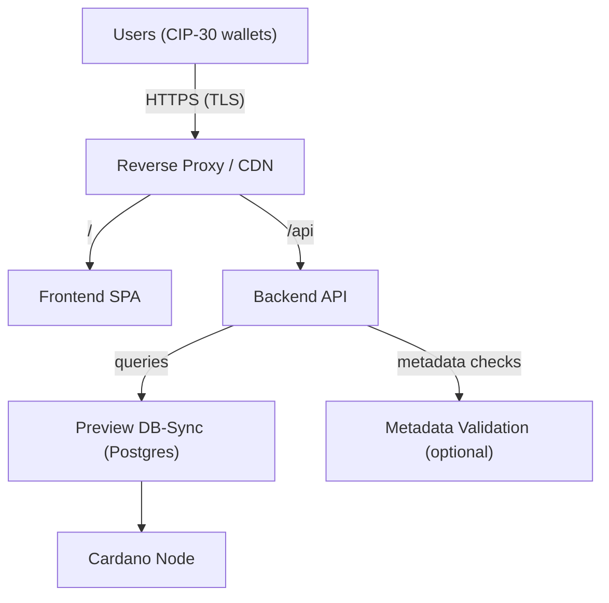

# GovTool Preview – 1× GA Review Sandbox (100 Concurrent Wallets)
This README describes production-lite hosting specs to run **GovTool (Preview network)** for a single Governance Action (GA) with up to **100 wallets connected concurrently**. It includes system sizing, packages, configuration, and operational guidance. Copy–paste and adapt to your domain.

## 1) Scope & Assumptions
- **Network:** Cardano **Preview** (testnet)  
- **Use case:** One GA (read + discuss; users may prepare/submit GAs on Preview if they hold tADA)  
- **Concurrency target:** ~100 simultaneous wallet connections (UI open + occasional API calls)  
- **Data source:** A **Preview DB-Sync** (your own or a managed provider) reachable by the GovTool backend  
- **Packages (Preview tags):**  
  - Backend: [`ghcr.io/intersectmbo/govtool-backend-preview`](https://github.com/IntersectMBO/govtool/pkgs/container/govtool-backend-preview)  
  - Frontend: [`ghcr.io/intersectmbo/govtool-frontend-preview`](https://github.com/IntersectMBO/govtool/pkgs/container/govtool-frontend-preview)  
  - Metadata Validation (recommended): [`ghcr.io/intersectmbo/govtool-metadata-validation-preview`](https://github.com/IntersectMBO/govtool/pkgs/container/govtool-metadata-validation-preview)  
- **Out of scope:** Running your own Cardano node/DB-Sync (can be external). If you self-host DB-Sync, provision separately.


## 2) High-Level Architecture



## 3) Capacity Planning (100 Concurrent Wallets)
**Traffic pattern:** Low–moderate throughput; backend read-heavy.  

**Recommended minimum (single host, dockerized):**
- vCPU: 4 cores  
- RAM: 8 GB  
- Disk (SSD/NVMe): 30 GB  
- Network: ≥100 Mbps symmetric, low latency to DB-Sync provider  

**Service-level sizing:**

| Service  | vCPU | RAM         | Notes                |
|----------|------|-------------|----------------------|
| Frontend | 1    | 512–1024 MB | Static assets only   |
| Backend  | 2    | 2–4 GB      | Query + metadata API |
| Metadata | 0.5–1| 512 MB      | Optional             |
| Proxy    | 0.5–1| 512 MB      | TLS, routing         |

**Scale up** by adding backend replicas or CDN offload if beyond 100 concurrent.

## 4) Packages & Roles (Preview)
- **Backend (Preview)** – [govtool-backend-preview](https://github.com/IntersectMBO/govtool/pkgs/container/govtool-backend-preview): REST API that queries DB-Sync and node; provides governance data to UI.  
- **Frontend (Preview)** – [govtool-frontend-preview](https://github.com/IntersectMBO/govtool/pkgs/container/govtool-frontend-preview): SPA with wallet integration (CIP-30/95); connects to backend.  
- **Metadata Validation (Preview)** – [govtool-metadata-validation-preview](https://github.com/IntersectMBO/govtool/pkgs/container/govtool-metadata-validation-preview): Validates GA metadata schema (optional but recommended).  

> Pin image tags (e.g., `…-125`), do not use `latest`.

## 5) Environment Variables

**Frontend**
```bash
VITE_API_BASE=https://api.example.com
VITE_NETWORK=preview
```

**Backend**
```bash
PORT=8081
NETWORK=preview
CORS_ALLOWED_ORIGINS=https://app.example.com
DB_SYNC_HOST=<provider-host>
DB_SYNC_PORT=5432
DB_SYNC_USER=<user>
DB_SYNC_PASSWORD=<password>
DB_SYNC_DATABASE=<db-name>
METADATA_VALIDATION_URL=http://metadata:8080
```

**Metadata Validation**
```bash
NETWORK=preview
```

## 6) Docker Compose (Reference)
```yaml
version: "3.9"
services:
  backend:
    image: ghcr.io/intersectmbo/govtool-backend-preview:REPLACE_WITH_TAG
    restart: unless-stopped
    environment:
      PORT: 8081
      NETWORK: preview
      CORS_ALLOWED_ORIGINS: https://app.example.com
      DB_SYNC_HOST: preview-dbsync.example.net
      DB_SYNC_PORT: "5432"
      DB_SYNC_USER: dbsync_user
      DB_SYNC_PASSWORD: dbsync_pass
      DB_SYNC_DATABASE: dbsync_preview
      METADATA_VALIDATION_URL: http://metadata:8080
    ports:
      - "8081:8081"

  metadata:
    image: ghcr.io/intersectmbo/govtool-metadata-validation-preview:REPLACE_WITH_TAG
    restart: unless-stopped
    environment:
      NETWORK: preview
    ports:
      - "8080:8080"

  frontend:
    image: ghcr.io/intersectmbo/govtool-frontend-preview:REPLACE_WITH_TAG
    restart: unless-stopped
    environment:
      VITE_API_BASE: https://api.example.com
      VITE_NETWORK: preview
    ports:
      - "8082:80"

  nginx:
    image: nginx:stable
    depends_on:
      - frontend
      - backend
    volumes:
      - ./infra/nginx.conf:/etc/nginx/nginx.conf:ro
    ports:
      - "80:80"
    restart: unless-stopped
```

**Example `nginx.conf`:**
```nginx
events {}
http {
  server {
    listen 80;
    server_name _;
    location /api/ {
      proxy_pass http://backend:8081/;
      proxy_set_header Host $host;
      add_header Access-Control-Allow-Origin $http_origin always;
      add_header Access-Control-Allow-Credentials true always;
      add_header Access-Control-Allow-Headers "*";
      add_header Access-Control-Allow-Methods "GET, POST, OPTIONS";
      if ($request_method = OPTIONS) { return 204; }
    }
    location / {
      proxy_pass http://frontend:80;
      proxy_set_header Host $host;
    }
  }
}
```

## 7) Configuration Checklist
- [ ] Frontend: `VITE_API_BASE`, `VITE_NETWORK=preview`  
- [ ] Backend: `NETWORK=preview`, DB-Sync credentials, CORS origin matches frontend  
- [ ] Metadata: `NETWORK=preview`  
- [ ] Proxy: HTTPS, routes `/→frontend` and `/api→backend`  
- [ ] Image tags pinned  
- [ ] Secrets stored securely  

## 8) Security & Compliance
- Enforce HTTPS and modern TLS.  
- Restrict CORS to your domain.  
- Add CSP, X-Frame-Options, X-Content-Type-Options.  
- Rate limit `/api`.  
- Rotate logs and redact sensitive info.  

## 9) Monitoring
- Health: `/api/health` → `200 OK`.  
- Metrics: request latency, 5xx count, DB-Sync lag.  
- Target uptime (Preview sandbox): **99.5%**.

## 10) Operational Runbook
```bash
docker compose up -d
curl http://<host>/api/health     # Should return OK
open https://app.example.com      # UI should load, wallet connects
```
- Verify wallet network = Preview.  
- Confirm GA appears correctly.  
- Optional: simulate 100 clients hitting read endpoints; ensure backend p95 < 500 ms.

## 11) Frontend Notes
- Highlight GA ID and link on homepage.  
- Label clearly: “Preview network – test ADA only.”  
- Provide link to tADA faucet.

## 12) Scaling Beyond 100 Concurrent
- Serve frontend via CDN (Netlify/Vercel/S3).  
- Add backend replicas behind a load balancer.  
- Keep backend close to DB-Sync region.  
- Cache GA endpoints if needed.

## 13) Troubleshooting
| Issue                 | Likely Cause      | Fix                                       |
|-----------------------|-------------------|-------------------------------------------|
| Blank GA list         | DB-Sync lag       | Verify network & provider                 |
| Wallet fails to connect | No HTTPS / wrong network | Enable HTTPS, set wallet to Preview |
| CORS blocked          | Origin mismatch   | Update backend `CORS_ALLOWED_ORIGINS`     |
| Slow API              | DB-Sync latency   | Relocate backend or upgrade IOPS          |

## 14) Useful Links
- Backend (Preview): [`ghcr.io/intersectmbo/govtool-backend-preview`](https://github.com/IntersectMBO/govtool/pkgs/container/govtool-backend-preview)  
- Frontend (Preview): [`ghcr.io/intersectmbo/govtool-frontend-preview`](https://github.com/IntersectMBO/govtool/pkgs/container/govtool-frontend-preview)  
- Metadata Validation (Preview): [`ghcr.io/intersectmbo/govtool-metadata-validation-preview`](https://github.com/IntersectMBO/govtool/pkgs/container/govtool-metadata-validation-preview)  
- Repo: [IntersectMBO/govtool](https://github.com/IntersectMBO/govtool)  
- Optional loader: [gov-action-loader](https://github.com/IntersectMBO/govtool/tree/develop/gov-action-loader)

## 15) License & Attribution
Check the upstream license in the [IntersectMBO/govtool](https://github.com/IntersectMBO/govtool) repository before public deployment. Pin versions and record image tags in your CHANGELOG.
